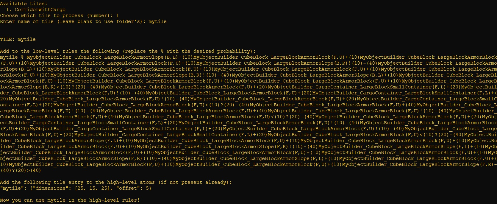

# 🚀 Space Engineers AI Spaceship Generator 🚀

  

### Download

#### Download AI Spaceship Generator for Windows from [the releases page](https://github.com/GoodAI/space-engineers-ai-spaceship-generator/releases).

### Introduction

Apps and code (`PCGSEPy` library) developed for the [Space Engineers](https://www.spaceengineersgame.com/) PCG project, supported by a [GoodAI research grant](https://www.goodai.com/using-open-ended-algorithms-to-generate-video-game-content-in-space-engineers/). The main app is the AI Spaceship Generator, which creates spaceships for Space Engineers using AI (for more information, see our [research explainer](#research) and [publications](#publications)). The second app is a Spaceships Ranker, which is used for conducting a user study.

### Development status

You can check the current status of development of the application at the [wiki](https://github.com/GoodAI/space-engineers-ai-spaceship-generator/wiki/Development-status).

## Application
The following is a quick overview of the application "AI Spaceship Generator". Further documentation is available within the application itself.

The application creates a log file each time it is launched. You can have more information in the log file by adding the `--debug` flag to the executable (note that this will produce much larger log files).

### AI Spaceship Generator (user mode)

  

The default mode for the app. The AI generates an initial "population" of spaceships (top left). When a spaceship is selected from the population it is visualised (top middle) and its properties are displayed (top right). You can choose to "evolve" a new set of spaceships based on either the selected spaceship or a random spaceship (the "evolution" process tries to construct new spaceships based on an existing spaceship). You can also re-initialise the population of spaceships.

### AI Spaceship Generator (developer mode)

  

An advanced mode, with full access to every part of the system that can be changed during the evolution process. You can launch the application in developer mode by adding the `--dev_mode` parameter to the executable.

### TilesMaker

  

The TilesMaker is a command-line application that makes it easy for any user to integrate their tiles in the "AI Spaceship Generator".

To create a tile, place the blueprint folder created in Space Engineers in the *tileset* folder (if it does not exist, it will be created when the application is first launched). The TilesMaker will then ask you which blueprint to create a tile from, as well as an optional custom name for the tile. Then, simply follow the instructions reported in the program to add the tile.

Remember to modify the high-level rules (*hlrules* and *hlrules_sm*) with your new tile, making sure the probability of expansions always sums up to 1 (otherwise an error will be thrown and the application will not start). For example, if you have create the tile *mytile* and the current high-level rules are:
- simpletile 1 nexttile

And you want *mytile* to be created from *simpletile* as well, then the updated high-level rules may be like this:
- simpletile 0.4 nexttile
- simpletile 0.6 mytile

Happy tile making!

## Roadmap
The user study period has concluded (November 2022); thanks to everyone who participated!.

After the end of 2022, the project's active support phase ended.

## Development
This project requires Python 3. The `PCGSEPy` library (including its requirements) can be installed by running `pip install -e .`. To use PyTorch in the library (required for some research experiments, but not the application), first set the `use_torch` flag in `configs.ini`.

We recommend creating a conda environment for the application. Make sure to install [orca](https://github.com/plotly/orca) via `conda install -c plotly plotly-orca` in case the spaceship download hangs (spinner on the top right remains visible for over 30 seconds to a minute).

### Building the apps
The application can be built using the provided `python build_main_webapp.py` file. The executable file will be created in the `dist` folder.

### Documentation
An explorable documentation is provided in `docs`. You can build the documentation by first installing `pdoc3` (`pip install pdoc3`) and then running the command `pdoc --html pcgsepy --force --output-dir  ./docs`.

#### Modifiable files
Some files can be modified before building the apps. These are:
- The estimators under the `estimators` folders: these are `.pkl` files and can be generated by running the `steam-workshop-downloader\spaceships-analyzer.ipynb` notebook (additional details are provided in the notebook itself).
- The `configs.ini` file: different settings can be specified in this file, making sure to respect the setting formats specified in `pcgsepy\config.py`.
- `block_definitions.json`: this file can be excluded from the application building file, but it is required to run the application. It can be recreated when the application is first launched if an instance of Space Engineers is open and the [iv4xr API](https://github.com/iv4xr-project/iv4xr-se-plugin) is installed.
- `hlrules`, `llrules`: these files define the expansion rules of the underlying L-system used in the application. `hlrules` determines the tile placements when creating spaceships, whereas `llrules` determines the game blocks used in a tile. If you want to add your own tiles in the application, please follow the instructions reported in `l-system\rules-extractor.ipynb` and remember to also update the `hl_atoms.json` file.

### Codebase overview
- `pcgsepy`: this directory contains the main Python PCGSEPy library.
- `steam-workshop-downloader`: this directory contains the code used to download the spaceships from the Steam Workshop and extract the metrics of interest.
- `l-system`: this directory contains the code used for the L-system and FI-2Pop experiments.
- `icmap-elites`: this directory contains the code used for the Interactive Constrained MAP-Elites experiments and the user study.

For more information, refer to the `README`s in each directory.

## Research

The AI Spaceship Generator consists of several components, allowing it to generate both functional and aesthetically-pleasing spaceships for Space Engineers. The basis is a rule-based procedural content generation algorithm that generates working ships, which is combined with an evolutionary algorithm that optimises their appearance, resulting in a novel hybrid evolutionary algorithm. The basic heuristics for the evolutionary algorithm to optimise were derived by analysing the properties of spaceships available on the Space Engineers’ Steam Workshop page.

This is then combined with a novel algorithm that finds a diverse set of spaceships, making more choices available. Finally, we have built a graphical interface for these algorithms so that you can influence the spaceship generator’s choices, alongside another novel algorithm that tries to tune the system to better follow the your ideas.

Starting from an initial population of vessels, you can select a spaceship to "evolve" - the underlying evolutionary algorithm then "mutates" this, creating new spaceships with similar properties (shape, size, etc.). This process can be repeated to continuously generate new spaceships.

## Publications

> [Gallotta, R., Arulkumaran, K., & Soros, L. B. (2022). Evolving Spaceships with a Hybrid L-system Constrained Optimisation Evolutionary Algorithm. In _Genetic and Evolutionary Computation Conference Companion_.](https://dl.acm.org/doi/abs/10.1145/3520304.3528775)

> [Gallotta, R., Arulkumaran, K., & Soros, L. B. (2022). Surrogate Infeasible Fitness Acquirement FI-2Pop for Procedural Content Generation. In _IEEE Conference on Games_.](https://ieeexplore.ieee.org/document/9893592)

> [Gallotta, R., Arulkumaran, K., & Soros, L. B. (2022). Preference-Learning Emitters for Mixed-Initiative Quality-Diversity Algorithms. _arXiv preprint arXiv:2210.13839_.]( https://arxiv.org/abs/2210.13839)
